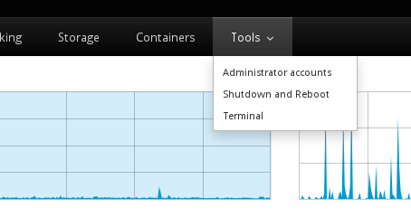
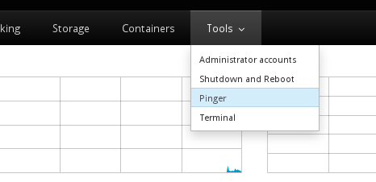
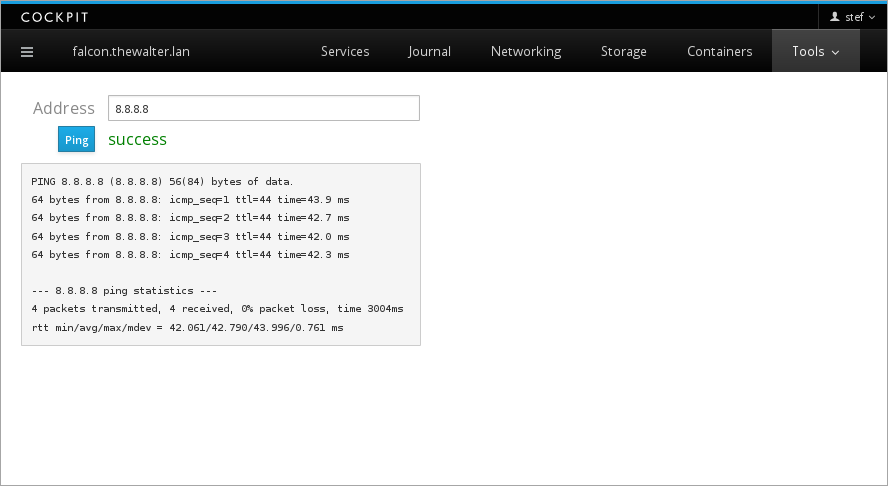

Title: Creating Plugins for the Cockpit User Interface
Date: 2014-11-13
Category: Cockpit, Linux
Tags: cockpit, linux
Slug: creating-plugins-for-the-cockpit-user-interface

*Note: This post has been updated for changes in Cockpit 0.90 and later.*

[Cockpit is a user interface for servers](http://cockpit-project.org). And you can add stuff to that user interface. Cockpit is internally built of various components. Each component is HTML, with Javascript logic that makes it work, and CSS to make it pretty.

It's real easy to create these components. Tools are components that show up in the *Tools* menu in Cockpit:

For example the *Terminal* that you see there is implemented as a tool. But lets make ourselves another one. For this tutorial you'll need Cockpit 0.41. You can install it in [Fedora 21](https://lists.fedorahosted.org/pipermail/cockpit-devel/2014-November/000196.html) or [build it from git](https://github.com/cockpit-project/cockpit/blob/master/HACKING.md).

So break out your terminal, lets make a package called *pinger* that checks whether your server has network connectivity to the Internet by pinging another host. Nothing too fancy. We'll just be spawning a process on the server to do the work. I've prepared it for you as [an example here](http://cockpit-project.org/files/pinger.tgz), and we can look it over, and modify it. To download the example to your current directory:

    :::text
    $ wget http://cockpit-project.org/files/pinger.tgz -O - | tar -xzf -
    $ cd pinger/

Components, and more specifically their HTML and Javascript files, live in package directories. In the package directory there's also a `manifest.json` file which tells Cockpit about the package. The `pinger` directory above is such a package. It's `manifest.json` file looks like this:

    :::text
    {
        "version": 0,
        "tools": {
            "pinger": {
                "label": "Pinger",
                "path": "ping.html"
            }
        },
        "content-security-policy": "default-src 'self' 'unsafe-inline' 'unsafe-eval'"
    }

The manifest above has a `"tools"` subsection. Each tool is listed in the *Tools* menu by Cockpit. The `"path"` is the name of the HTML file that implements the tool, and the `"label"` is the text to show in the *Tools* menu.

You'll notice that we haven't told Cockpit about the package yet. To do so you either place or symlink the package into one of two places:

 * `~/.local/share/cockpit` 
In your home directory, for user specific packages, and ones that you're working on. You can edit these on the fly and just refresh your browser to see changes.
 * `/usr/share/cockpit` 
For installed packages available to all users. These should not be changed while Cockpit is running.

Since we're going to be messing around with this package, lets symlink it into the former location.

    :::text
    $ mkdir -p ~/.local/share/cockpit
    $ ln -snf $PWD ~/.local/share/cockpit/pinger

You can list which Cockpit packages are installed using the following command, and you should see `pinger` listed among them:

    :::text
    $ cockpit-bridge --packages
    ...
    pinger: /home/.../.local/share/cockpit/pinger
    ...

If you're logged into Cockpit on this machine, first log out. And log in again. Make sure to log into Cockpit with your current user name, since you installed the package in your home directory. You should now see a new item in the *Tools* menu:

The pinger tool itself looks like this:

Lets take a look at the pinger HTML, and see how it works.

    :::html
    <head>
        <title>Pinger</title>
        <meta charset="utf-8">
        <link href="../base1/cockpit.css" type="text/css" rel="stylesheet">
        
        
    </head>
    <body>
        

            <table class="cockpit-form-table">
                <tr>
                    <td>Address</td>
                    <td><input class="form-control" id="address" value="8.8.8.8"></td>
                </tr>
                <tr>
                    <td><button class="btn btn-primary" id="ping">Ping</button></td>
                    <td></td>
                </tr>
            </table>
            
<pre id="output"></pre>

        

        
    </body>
</html>

First we include `jquery.js` and `cockpit.js`. `cockpit.js` defines the basic API for interacting with the system, as well as Cockpit itself. You can find [detailed documentation here](http://files.cockpit-project.org/guide/latest/api-cockpit.html).

    :::html
    
    

We also include the cockpit.css file to make sure the look of our tool matches that of Cockpit. The HTML is pretty basic, defining a little form with a field to type an address, a button to click to start the pinging, and an area to present output and results.

In the javascript code, first we get a bunch of variables pointing to the HTML elements we want to interact with.
Next we attach a handler to the *Ping* button so that the `ping_run()` function is called when it is clicked.

    :::javascript
    $("#ping").on("click", ping_run);

    function ping_run() {

In the `ping_run()` function is where the magic happens. `cockpit.spawn` is a function, [documented here](http://files.cockpit-project.org/guide/latest/api-cockpit.html#latest-spawn) that lets you spawn processes on the server and interact with them via stdin and stdout. Here we spawn the `ping` command with some arguments:

    :::javascript
        var proc = cockpit.spawn(["ping", "-c", "4", address.val()]);

In a web browser you cannot block and wait until a method call completes. Anything that doesn't happen instantaneously gets its results reported back to you by [means of callback handlers](http://files.cockpit-project.org/guide/latest/api-cockpit.html#latest-spawn-done). jQuery has a standard interface [called a promise](http://api.jquery.com/deferred.promise/). You add handlers by calling the `.done()` or `.fail()` methods and registering callbacks. `proc.stream()` registers a callback to be invoked whenever the process produces output.

    :::javascript
        proc.done(ping_success);
        proc.stream(ping_output);
        proc.fail(ping_fail);
        ...
    }

The `ping_success()` and `ping_fail()` and `ping_output()` update the display as you would expect.

So there you go ... it's a simple plugin to start off with ... next time we'll cover [how to use DBus](http://files.cockpit-project.org/guide/latest/api-cockpit.html#latest-dbus), and then the real fun begins.
